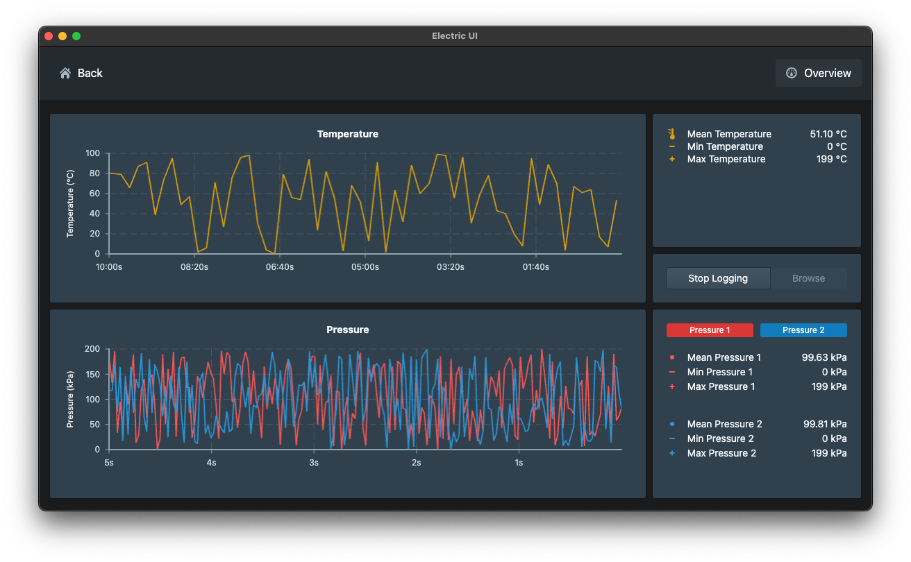

# Data Logger

A small temperature and pressure data logger project.

# 

Features:

- Basic hardware timestamped temperature and pressure readings.
- Basic stats from the rolling view window.

## To Install

Navigate to the `interface` folder and run `arc install`.

## To Run

Navigate to the `interface` folder and run `arc start`.
